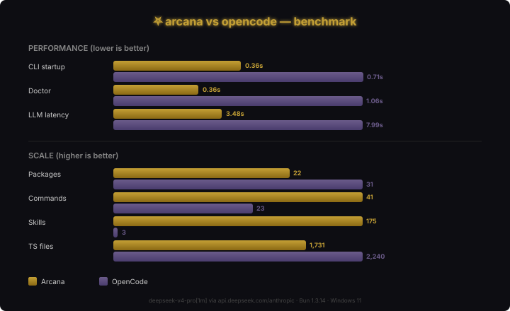

# ⛧ arcana

**Self-improving AI agent CLI** — skills, memory, gateway, coding, and cron in one terminal.

[](https://www.npmjs.com/package/arcana-ai)
[](LICENSE)

## vs OpenCode

Arcana began as an OpenCode fork. It's now faster, leaner, and more capable.

<p align="center">
  
</p>

```sh
arcana doctor            # check system health
arcana run "query"       # agent session / TUI
arcana console login     # pair with Arcana account (device flow)
arcana trust             # trust this workspace for project plugins/tools
arcana models            # list models
arcana providers         # manage provider credentials
arcana session list      # past sessions
arcana stats             # usage stats
arcana serve             # local headless server (loopback by default)
```

**Docs:** [arcana.otnelhq.com/docs](https://arcana.otnelhq.com/docs) · in-repo campaign docs: [STATUS](docs/STATUS.md) · [TASKS](docs/TASKS.md) · [BLOCKERS](docs/BLOCKERS.md) · [COMPLETION-REPORT](docs/COMPLETION-REPORT.md) · [FREEZE-RELEASE](docs/FREEZE-RELEASE.md)

## Install

```sh
# Quick start (shim downloads binary on first run)
npx arcana-ai

# Or global install
npm install -g arcana-ai
arcana

# From source (dev)
git clone https://github.com/Lento47/arcana && cd arcana
bun install
bun link                 # from packages/arcana/ — creates global `arcana` bin
```

Package name is **`arcana-ai`**; the binary is always **`arcana`**.

## Quick start

```sh
# 1) Provider key (BYOK) — any supported vendor
export OPENAI_API_KEY=sk-...        # or ANTHROPIC_API_KEY, GEMINI_API_KEY, etc.

# 2) Optional: pair with Arcana console + proxy license
arcana console login                # https://arcana.otnelhq.com (device seal)

# 3) Optional: trust this repo if it has project plugins/tools/MCP
arcana trust

# 4) Run
arcana doctor
arcana run "explain this codebase"
# or: arcana
```

### Gateway (chat bots)

Configure in `~/.arcana/config.json`:
```json
{
  "provider": "openai",
  "model": "gpt-4o",
  "gateway": {
    "telegram": { "token": "111:xxx" },
    "discord": { "token": "xxx" },
    "slack": { "botToken": "xoxb-xxx", "signingSecret": "xxx" }
  }
}
```

```sh
arcana gateway
```

### Cron

```sh
# Every 4 hours: run code review
arcana cron add --name "review PRs" --schedule "0 */4 * * *" --prompt "review open PRs for bugs"

# Daily summary
arcana cron add --name "daily digest" --schedule "@daily" --prompt "summarize today's changes"

# List / remove / pause / resume / run-now
arcana cron list
arcana cron remove --id <job-id>
arcana cron pause --id <job-id>
arcana cron resume --id <job-id>
arcana cron run --id <job-id>
arcana cron start    # run daemon (blocking)
```

## Providers

Set a provider key as an environment variable and the matching provider lights up automatically — no per-vendor command needed:

```sh
export OPENAI_API_KEY=sk-...
export ANTHROPIC_API_KEY=sk-ant-...
export GEMINI_API_KEY=...
```

The full catalog of supported providers and their env keys is documented in `packages/arcana/src/provider/`. Use `arcana doctor` to confirm a key is detected.

## Packages

20+ packages organized in a layered architecture. Full details: [system-architecture.md](.hermes/docs/arcana/docs/architecture/system-architecture.md) · [arcana-comprehensive-guide.md](.hermes/docs/arcana/docs/arcana-comprehensive-guide.md)

| Layer | Packages | Purpose |
|-------|----------|---------|
| **Entry** | `arcana`, `engine`, `enterprise` | CLI, TUI (SolidJS + OpenTUI), web dashboard |
| **Presentation** | `tui`, `ui` | Terminal UI (7 themes), web components (20+ locales) |
| **Service** | `server`, `gateway`, `plugin`, `plugin-legacy`, `sdk` | Hono HTTP API, chat adapters, 30+ plugin hooks, JS client |
| **Core** | `core`, `memory`, `cron`, `skills`, `ml` | Effect runtime, SQLite+FTS5 memory, scheduler, quality gate |
| **Foundation** | `llm`, `effect-drizzle-sqlite`, `effect-sqlite-node` | 33+ LLM providers, database bridges |
| **Infra** | `http-recorder`, `function`, `script` | VCR cassettes, CF Workers, build/release |

## Deep Dive

Ready-to-use features beyond the basics. Full guide: [arcana-comprehensive-guide.md](.hermes/docs/arcana/docs/arcana-comprehensive-guide.md)

| Feature | Command / Config | Docs |
|---------|-----------------|------|
| **Memory** | `arcana memory search "query"` | [session-compaction.md](.hermes/docs/arcana/docs/session-compaction.md) |
| **History** | `arcana history list` / `arcana history resume --id <id>` | [arcana-updates-v0.3.5.md](.hermes/docs/arcana/docs/arcana-updates-v0.3.5.md) |
| **Learn** | `arcana learn list` / `arcana learn moc` | [arcana-comprehensive-guide.md](.hermes/docs/arcana/docs/arcana-comprehensive-guide.md) |
| **Doctor** | `arcana doctor` | [configuration.md](.hermes/docs/arcana/docs/configuration.md) |
| **Gateway** | `arcana gateway` (Telegram, Discord, Slack, WhatsApp) | [gateway.md](.hermes/docs/arcana/docs/gateway.md) |
| **Cron** | `arcana cron add --name ... --schedule ... --prompt ...` | [cron.md](.hermes/docs/arcana/docs/cron.md) |
| **ML Engine** | `ARCANA_ML_RUNTIME=1 arcana run "..."` | [arcana-comprehensive-guide.md](.hermes/docs/arcana/docs/arcana-comprehensive-guide.md) |
| **Web App** | `bun run dev:web` (Vite + SolidJS Start) | [arcana-comprehensive-guide.md](.hermes/docs/arcana/docs/arcana-comprehensive-guide.md) |
| **Plugins** | 30+ hooks via `@arcana/plugin` | [arcana-comprehensive-guide.md](.hermes/docs/arcana/docs/arcana-comprehensive-guide.md) |
| **HTTP Recorder** | `import { HttpRecorder } from "@arcana/http-recorder"` | [arcana-comprehensive-guide.md](.hermes/docs/arcana/docs/arcana-comprehensive-guide.md) |

## Skills

174+ skills across 28 categories. Full guide: [skills.md](.hermes/docs/arcana/docs/skills.md)

```sh
arcana skills list                    # all skills
arcana skills list --query "python"   # search
arcana run --skill git "review changes"  # activate a skill
```

Skills live in `skills/` (in-repo) and `~/.arcana/skills/` (user-local). Each is a `SKILL.md` with YAML frontmatter — add your own.

## Configuration

`~/.arcana/config.json` — most settings have sensible defaults and can be overridden with env vars. Full reference: [configuration.md](.hermes/docs/arcana/docs/configuration.md)

```json
{
  "provider": "openai",
  "model": "gpt-4o",
  "apiKey": "sk-...",
  "memory": { "enabled": true, "maxSessions": 1000 }
}
```

Env overrides: `ARCANA_PROVIDER`, `ARCANA_MODEL`, `ARCANA_API_KEY`, `OPENAI_API_KEY`. No config file required — just set a key and run.

## Dev

```sh
bun install
bun run typecheck       # turbo typecheck (16 packages)
bun run lint            # oxlint (warnings only; 0 errors required)
bun run test            # turbo test
bun run ml:eval         # @arcana/ml evaluation fixtures (12/12)
bun run smoke           # CLI/TUI/ML/web surface sanity check (~1s)
bun run verify          # lint + typecheck + test + ml:eval + build
bun run build           # turbo build
```

### Arcana TUI

```sh
bun run dev:tui          # from repo root
# or
bun run --cwd packages/engine --conditions=browser packages/engine/src/index.ts
```

### Arcana CLI (standalone, no TUI)

```sh
bun packages/arcana/src/index.ts run "hello"
```

## Themes

7 arcane themes. Press `⛧ themes` in the TUI or set in `~/.config/arcana/tui.json`:
```json
{ "theme": "dragon" }
```

Themes: `arcana` (default), `bloodmoon`, `coven`, `crypt`, `dragon`, `lich`, `wraith`.

### Background image

Set a custom full-screen background image (truecolor terminals — Kitty, iTerm2, WezTerm, Windows Terminal). In `~/.config/arcana/tui.json`:
```json
{
  "background": {
    "enabled": true,
    "image": "~/wallpapers/space.png",
    "opacity": 0.4,
    "fit": "cover"
  }
}
```
`opacity` (0–1) dims the image so text stays readable. PNG/JPEG. Shows on the home screen and empty areas; falls back to the theme color where unsupported.

## Recent Changes

- **v0.3.8** — Freeze evidence pack ([FREEZE-EVIDENCE-2026-08-06.md](docs/FREEZE-EVIDENCE-2026-08-06.md): real suite numbers, 16 evidence logs), governance protections ([FREEZE-GOVERNANCE.md](docs/FREEZE-GOVERNANCE.md)), freeze-evidence CI workflow, CURRENT-STATE.json reconciliation, audit-7 convergence campaign completion, cross-platform smoke matrix + script (Windows executed, Linux/macOS NOT EXERCISED), CLI launch adapter certification, DX quickstart + reference app + samples, deployment runbook (BLK-D-07). See [STATUS.md](docs/STATUS.md).
- **v0.3.7** – Capability fresh-db bootstrap + search index scan await, D-9 offline PEP partition wiring, Rust SDK envelopes + PEP client, CLI JSON output + deterministic exit codes, shell completion (bash/zsh/fish), F-5 escalation + F-6 auditor consoles, F-10 regional storage + CMK enforcement, tenant HTTP isolation suite, manager governance endpoint, F-12 telemetry ingestion, F-11 ticketing transports. See [STATUS.md](docs/STATUS.md).
- **v0.3.6** — Enterprise admin identity boundary (authenticated principal → tenant → RBAC; client-supplied actor fields rejected), approval durability hardening (SQL-level CAS transitions, fail-closed CONSUME with explicit recovery, deterministic stale refusal), operator workspace binding, runtime API routing fixes. See [STATUS.md](docs/STATUS.md).
- **v0.3.5** — Workspace trust (`arcana trust`), console login ceremony + device-flow resilience, security hardenings (gateway allowlists, WhatsApp signatures, non-loopback serve auth, env_write sandbox), command-spine + theme polish, goals MVP. Public docs: https://arcana.otnelhq.com/docs
- **v0.3.4** — QA fixes: session locking, secret redaction, streaming timeouts, command-spine UX. See [qa-fixes-2026-07-10.md](.hermes/docs/arcana/docs/qa-fixes-2026-07-10.md).
- **v0.3.0** — Command Spine shell, OpenTUI pin, plugin system, cron daemon, web dashboard.

Security remediation status: [security-posture-2026-07-20.md](.hermes/docs/arcana/docs/security-posture-2026-07-20.md).

---

Arcana builds on incredible open-source work:

- **[OpenCode](https://github.com/anomalyco/opencode)** — the TUI engine (SolidJS + OpenTUI), provider system, tools, and CLI architecture. Arcana began as a fork and would not exist without it.
- **[Hermes Agent](https://github.com/Lento47/hermes-agent)** — autonomous AI agent framework with sandboxing, memory, and multi-provider routing. Powers arcana's non-interactive agent mode.
- **[models.dev](https://models.dev)** — community model catalog powering arcana's provider auto-discovery (200+ models across 33 providers).
- **[Effect](https://effect.website)** — typed functional effect system for reliable concurrency, error handling, and dependency injection.
- **[Bun](https://bun.sh)** — JavaScript runtime, bundler, and compiler. The zero-dependency standalone binary is produced by `Bun.build({ compile })`.
- **[SolidJS](https://solidjs.com)** + **[OpenTUI](https://github.com/opentui/core)** — reactive UI framework + terminal rendering engine.
- **[AI SDK](https://sdk.vercel.ai)** — unified LLM provider interface (OpenAI, Anthropic, Google, Bedrock, and 30+ more).
- 174 skills from the open-source community across 28 categories.

All arcana modifications are MIT-licensed and upstreamable.

## License

Dual-licensed under MIT (non-commercial) and Commercial. See [LICENSE](LICENSE).
